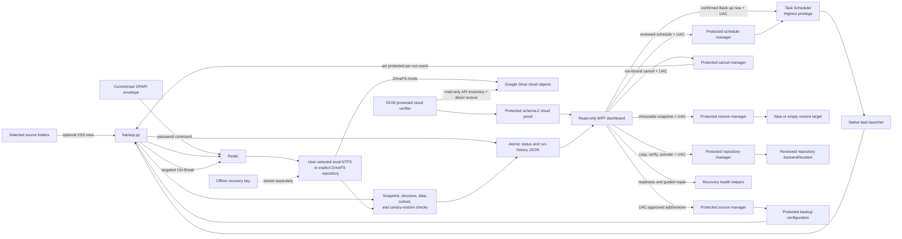

# Architecture

This document describes Proofhold v0.2.0-alpha.1 for Windows x64 and macOS
arm64/x64. The product uses one shared React dashboard inside two native
desktop shells. The Windows implementation retains the `ResticBackuper`
executable, task, and protected-state identifiers for compatibility. Restic
remains the component that creates, encrypts, deduplicates, and restores
repository snapshots.

## Shared dashboard and motion

The dashboard is a real application surface shared by the Windows WebView2
host and the macOS Electron host. It incorporates the literal Beautiful UI
components pinned in [`src/dashboard/web/vendor/UPSTREAM.md`](../src/dashboard/web/vendor/UPSTREAM.md),
including the navigation rail, task rows, filter table, insight cards, context
cards, loading states, and their source keyframes. The integration keeps the
upstream DOM structure and interaction motion while connecting those elements
to the real backup, restore, schedule, and readiness state.

React Motion supplies page transitions, staggered content, expandable-row
feedback, and reduced-motion handling. Liveline renders the activity trend
without inventing backup state. The web bundle contains no default remote demo
video or network-backed backup data: animation is decorative and every status,
snapshot, and action comes from the native host contract. Upstream provenance
and the required MIT notice are kept beside the copied source.

## Runtime flow

The scheduled task launches a small native supervisor from the protected
installation directory. The supervisor starts the embedded Python interpreter
in isolated mode and assigns it to a Windows job object. Closing the supervisor
also terminates descendants, reducing the chance that an abandoned Restic
process continues writing to the repository.

`backup.py` obtains a single-run lock, validates the configured repository
volume and available space, and invokes Restic with the exact source and
exclusion set. When configured, Restic asks Windows VSS for filesystem
snapshots of local fixed NTFS sources so open files can be read from a
consistent view.

## macOS runtime flow

The macOS shell uses Electron with context isolation, a sandboxed renderer,
and a narrow preload bridge. Renderer commands are allowlisted and validated
before they reach the main process; the renderer cannot spawn a process, read
arbitrary files, or navigate to an arbitrary URL. Native folder and save
dialogs stay in the main process.

`desktop/macos/service.cjs` drives the pinned Restic 0.19.1 binary with a
temporary `RESTIC_PASSWORD_FILE`. The repository password is encrypted with
macOS safe storage and is never placed in a command argument or ordinary
dashboard state. Setup initializes a local folder repository, records exact
source folders, and offers a separate recovery-key export. A backup emits
JSON progress, then requires a complete snapshot summary, `restic check`, a
canary restore, and a content hash check before publishing success.

Restore browsing lists real repository snapshots and projected entries. A
restore request carries an immutable snapshot ID and optional path, selects a
new or empty destination, rejects overlap with sources or the repository, and
uses Restic verification. Cancellation sends the child a cooperative signal;
it does not delete snapshots or repair a repository. The schedule adapter
writes a per-user launchd agent and rolls back its prior job if persistence or
launchd bootstrap fails.

## Successful-run criteria

A Restic process exit code alone does not mark a run successful. The wrapper
also requires:

1. A complete Restic summary without an incomplete snapshot.
2. A snapshot bound to the expected hostname, tag, and exact configured source
   set.
3. A successful `restic check` of repository structure.
4. A restore of the installed canary file into a temporary state directory,
   including Restic verification and a local SHA-256/content-size comparison.
5. On the configured weekday, a successful rotating read of one repository
   data subset. The default configuration divides this deeper check into 30
   parts.

Only after these checks does the wrapper atomically update the last-successful
run record. The canary proves that this run can locate, decrypt, and restore a
known small file; it does not prove that every user file is healthy. Independent
restores of representative user data remain essential.

## Components

The following table describes the Windows protected runtime. The executable
and task names are intentionally still `ResticBackuper` inside the branded
Proofhold release.

| Component | Responsibility | Write scope |
| --- | --- | --- |
| `ResticBackuperTaskLauncher.exe` | Supervises the scheduled Python/Restic process and ties descendants to a kill-on-close job object | None directly |
| Embedded Python and `backup.py` | Validates configuration, drives Restic, verifies results, records status | Repository through Restic; protected state |
| `restic.exe` | Creates encrypted snapshots, checks the repository, and restores data | Repository and explicit restore target |
| `ResticBackuperDashboard.exe` | Reads status, logs, history, and configured sources; launches explicit UAC folder changes; validates and requests the fixed backup task after confirmation | No direct configuration or repository writes |
| `Manage-Sources.ps1` | Validates and transactionally adds/removes future backup sources while holding the run lock; a durable undo journal coordinates atomic per-file replacements | Protected configuration, protected journal, and recovery-tools metadata |
| `Manage-Schedule.ps1` | Applies a reviewed daily or selected-day trigger and supported task settings with fingerprint binding, verification, and rollback | Exact backup task definition only |
| `Manage-Backup.ps1` | Revalidates the exact active run and protected task, then signals only that run's protected cancellation event | Per-run event signal and bound result file only |
| `Manage-Repository.ps1` | Copies, manifest-checks, and atomically activates a reviewed local or explicit DriveFS repository destination; resumes or rolls back interrupted relocation | New repository, separate protected-NTFS recovery-tools destination, protected configuration, and journal |
| `Manage-Restore.ps1` and `restore.py` | Bind browsing and restore requests to the current plan, generation, repository, and immutable snapshot ID; restore to a non-overlapping new or empty target | Explicit restore target and protected restore report only |
| Recovery helpers | Inspect independent recovery paths and perform explicitly approved credential repair, stale-lock cleanup, key rotation, and anomaly acknowledgement | Narrow protected records or Restic credential/lock commands for the selected action |
| `DiagnosticExporter.cs` | Builds a bounded support ZIP after removing secrets, identities, host names, command lines, and personal paths | User-selected diagnostic ZIP only |
| Google Drive verifier | Holds the protected run lock, compares the sole DriveFS repository with a read-only API inventory, and restores the canary through a direct cloud backend | Protected verification runs/evidence only; no repository writes |
| Installer/uninstaller | Installs protected runtime, creates tasks and shortcuts, manages application binaries | Program Files, ProgramData, Task Scheduler, registry, chosen repository during initialization |

### macOS host components

| Component | Responsibility | Write scope |
| --- | --- | --- |
| Electron main process and preload bridge | Creates the native window, owns dialogs, enforces the IPC command allowlist, and routes state updates to the shared dashboard | Per-user app data and explicit dialog destinations |
| `desktop/macos/service.cjs` | Initializes and drives real Restic backups, checks, canary restores, snapshot browsing, verified restores, cancellation, and recovery-key export | Selected local repository, explicit restore target, encrypted password envelope, bounded status/history |
| `desktop/macos/scheduler.cjs` | Installs and removes the per-user daily launchd agent with transactional rollback | User LaunchAgents entry and schedule state |
| Bundled Restic 0.19.1 | Creates encrypted snapshots, checks the repository, and restores selected content | Selected local repository and explicit restore target |

The macOS shell does not expose the Windows VSS, UAC, DPAPI, DriveFS cloud
proof, repository-migration, or advanced repair managers. The dashboard hides
those actions instead of presenting controls that the host cannot honor.

## On-disk boundaries

### `C:\Program Files\ResticBackuper`

Contains the manifest-hashed application payload: embedded Python, Restic,
the Python wrappers, configuration, dashboard, task launcher, exclusions, and
uninstaller. The scheduled task runs at Highest privilege for VSS access, so
ordinary users must not be able to replace files in this tree.

### `C:\ProgramData\ResticBackuper`

Contains the CurrentUser DPAPI password envelope, protected restore canary, run
lock, status records, structured failure detail, JSONL logs, last-successful
record, and local metrics history. During protected changes it may also contain
source-update, repository-relocation, or credential-rotation journals plus
bounded result/evidence records. Writers run from the protected scheduled task
or narrowly scoped elevated managers; the dashboard receives read access.

### User-selected repository

Contains Restic's encrypted repository. The default `local_ntfs` mode accepts a
local fixed/removable NTFS drive-letter path. The explicit
`google_drivefs_stream` mode accepts only a strict descendant of
`G:\My Drive`, bound to the current user's `%LOCALAPPDATA%\Google\DriveFS`
cache. Both modes record the volume serial. DriveFS additionally requires the
provider process, fixed FAT32 mount and remote-storage capability, at least
10 GiB of cache headroom, an atomic provider transaction, and repository
objects strictly smaller than 4 GiB.

The repository must not overlap a source. Relocation copies into a nonce-bound
sibling stage and records an exact path/byte/SHA-256 commit-manifest digest in
the protected journal. It verifies that inventory before and after copy,
verifies repository ID, snapshot history, and structure, and only then
same-parent-renames the stage and switches protected metadata atomically. A
DriveFS destination must be absent, not merely empty, so rollback never depends
on synthetic FAT32 ACL restoration. The old repository is retained. No
automatic `forget`, `prune`, or repository deletion occurs.

### Recovery material

For `local_ntfs`, the installer places a self-contained recovery-tools directory
beside the repository. For `google_drivefs_stream`, it places that bundle at
`C:\ProgramData\ResticBackuperRecoveryTools`; recovery tools, the DPAPI
envelope, ProgramData state, and the initially generated recovery key must all
remain on NTFS outside DriveFS. Protected plan changes refresh the bundle
transactionally. The tools intentionally do not contain the password. The user
must move the key to separate, secure storage.

The DPAPI envelope is convenient for unattended use on the current Windows
profile. It is not a substitute for the recovery key: after loss of that
profile, the envelope may be unusable.

### Direct Google Drive verification

For `google_drivefs_stream`, the live repository below the My Drive streaming
mount is the only Restic repository path. The optional daily 03:00 task is
verification-only; despite its compatibility task name, it does not copy to a
local mirror.

The Highest/Interactive verifier takes the existing byte-range run lock, derives
the cloud path from the protected repository and My Drive configuration, and
authenticates both the local mount and Google Drive API view as the same Restic
repository. It requires an exact case-sensitive path, length, MD5, SHA-256, and
provider-object-ID inventory before restoring the protected canary through the
`rclone:` backend. That restore bypasses DriveFS and uses the complete snapshot
ID from the latest successful backup.

Rclone, its encrypted configuration, its CurrentUser-DPAPI configuration
password, and the packaged reveal helper are copied into
`C:\ProgramData\ResticBackuperCloudVerification`. A four-file size/hash
manifest, Administrators ownership, protected inheritance, read-only
normal-user ACL, and a no-reparse tree are checked before and after each run.
The verifier never resolves those assets through `PATH` or a user-writable
application-data directory. Native output is copied as bytes from redirected
process streams so Windows PowerShell 5.1 cannot text-transform inventory JSON.
Primary and verifier task exports use distinct generated evidence names, and
are the only files exempt from the immutable runtime inventory. Task XML
validation treats an omitted `Enabled` element as the schema default (`true`),
while rejecting explicit false, malformed, or duplicate values. Replace-existing
evidence and dashboard state use unique same-directory backup files because
.NET Framework does not accept a null backup path for this operation.

Immutable per-run evidence and an atomically replaced schema-2 latest proof
remain in that protected tree. The dashboard accepts a green status only when
the proof is post-activation and matches the current plan, configuration
generation, repository path/ID, latest snapshot, exact inventory, protected
asset manifest, and direct-cloud restore. Any newer backup attempt makes it
stale. Legacy local-mirror status is explicitly rejected.

## Installer and supply chain

The public Windows alpha is distributed as both a transparent ZIP and a
Proofhold setup executable. The setup executable embeds the same ZIP and
launches the existing reviewed PowerShell installer; it does not introduce a
second installer implementation. Both paths embed pinned Windows x64 releases
of Python 3.14.6 and Restic 0.19.1, so installation does not execute an
unpinned Restic or Python download. If WebView2 is missing, the setup flow
downloads Microsoft's signed WebView2 bootstrapper and verifies that the
runtime is available before opening the dashboard.

The Windows release build verifies the upstream archive hashes recorded in
`dependencies.json`, verifies the extracted Restic executable hash, and emits
checksums for the ZIP and setup executable. The installer validates every
staged payload file against its own path, size, and SHA-256 manifest before
copying it into the protected runtime.

ZIP entry metadata is normalized, but the legacy .NET Framework C# compiler can
emit nondeterministic executable bytes. Rebuilding the same source is therefore
not guaranteed to reproduce the release ZIP byte for byte. The published
SHA-256 identifies the exact frozen release artifact; it is an integrity value,
not a reproducible-build claim.

This is integrity checking, not publisher authentication. v0.2.0-alpha.1 has
no Authenticode signature on Windows and no Developer ID signature or
notarization on macOS. Users must obtain checksums from the project's GitHub
release, compare them locally, and decide whether they trust the project.
Signing credentials are deliberately not required by the alpha build.

The macOS build runs `npm ci`, builds the shared dashboard, downloads the
official Restic 0.19.1 archive for the requested arm64 or x64 architecture,
checks it against `desktop/scripts/restic-SHA256SUMS.txt` and the pinned
manifest, then uses electron-builder to produce a DMG and ZIP. The final app
bundle includes the Electron runtime notices and the web dependency notices.
Smoke testing invokes the real service and preload bridge against a temporary
fixture; it does not fall back to demo backup data.

## Installation and privilege model

The installer starts interactively as the intended backup user, then requests
UAC elevation. It verifies that elevation remains under the same Windows SID;
CurrentUser DPAPI material created through a different administrator account
would not work for the scheduled user.

Installation creates:

- a protected application directory and protected state directory;
- an initialized Restic repository, or validates the selected existing one;
- a daily Highest-level backup task for the installing user;
- optionally, a Limited-level dashboard task at logon;
- a Start menu shortcut and a Windows uninstall registration; and
- the DPAPI envelope, recovery key, and portable recovery tools.

The installer refuses an in-place alpha upgrade and refuses conflicting task
names or an existing runtime. The conservative uninstaller removes only the
application runtime, its verified backup/dashboard/cloud-verification tasks,
shortcut, and uninstall registration. It preserves the repository, ProgramData
state, DPAPI envelope, recovery key, recovery tools, and protected cloud
verification assets/evidence.

The backup task uses an interactive logon token so CurrentUser DPAPI and the
user profile are available. Scheduled runs therefore require the installing
user to be signed in.

The limited dashboard cannot write Program Files. Add/remove actions start the
protected source manager through UAC with the requesting user's SID. The
manager takes the same byte-range lock used by the backup wrapper, rejects
repository/runtime/state overlap and nested sources, protects the canary and
last user source, and enforces the same drive policy as installation: every
source must be on a ready local fixed or removable drive-letter volume; VSS
tightens that policy to fixed NTFS volumes. UNC and network sources are never
accepted. Removing a source changes future snapshots only; it never forgets or
prunes existing snapshots.

Each installed configuration has a random stable `plan_id` and a monotonically
increasing `config_generation`. Elevated requests bind to both, the exact
configuration hash, and the requesting Windows SID. Every configured source is
also bound to its expected volume serial. The backup preflight rejects an
offline source, a mismatched volume, nested/overlapping source topology, and by
default a cloud placeholder that is not locally materialized. These checks
prevent a reused drive letter or stale approval from silently changing scope.

Cloud-placeholder classification uses per-call Win32 extended-length paths, so
included names beyond `MAX_PATH` remain classifiable without changing the
machine-wide registry policy. To keep the preflight aligned with the actual
backup scope, it prunes only whole directories that are demonstrably covered
by the active case-insensitive Restic exclusion file. A descendant that
disappears during enumeration is recorded as a benign race; root loss,
included access failures, unknown attributes, and included cloud-only content
remain fatal.

Before replacing any of the four coupled source-metadata files, the manager
writes and flushes a protected undo journal containing the verified previous
and proposed bytes for fixed target identities. Each file is then replaced
atomically and the new set is fully revalidated. Deleting the journal is the
commit point. A backup refuses to start while a journal is pending; after a
process termination or restart, the next manager invocation restores and
verifies the complete previous set before deleting the journal. This avoids
consuming a mixed live/recovery manifest set after an interrupted change.

Schedule changes follow the same privilege boundary. The dashboard reads Task
Scheduler as the source of truth, previews the requested policy, and launches a
protected manager through UAC. The manager rejects a running backup, checks the
baseline XML fingerprint, preserves fixed action/principal invariants, verifies
the registered task, and rolls back on failure. The dashboard then performs an
independent read before reporting success.

Repository relocation uses the same global byte-range lock and plan binding.
Local repository and recovery stages retain the protected NTFS ACL policy.
DriveFS repository stages instead use an exact nonce path, ownership marker,
and commit-manifest digest because its synthetic FAT32 ACL cannot carry that
policy; the recovery stage still uses protected NTFS. The manager copies
without deleting the old tree, checks every path/size/hash plus repository
identity/history/structure, and revalidates final trees immediately before
publishing configuration and manifest metadata. A flushed journal records
destination ownership and every publication phase. If the process stops, the
manager can return to the exact pre-change metadata while removing only a
destination it proves through the journal, marker, and manifest.

Restore requests are reviewed in the limited dashboard and executed through a
separate elevated manager. Snapshot browsing returns bounded JSON. Plan-bound
snapshots retain their plan and generation identity. A pre-plan snapshot is
shown separately as **Legacy / unbound** only when it has no plan/generation
tags and its computer, scheduled tags, and complete source set exactly match
the current protected configuration. Legacy browsing and restore require the
full immutable ID and a separately digest-bound opt-in; `latest` and ID prefixes
cannot opt in. Snapshot metadata is never rewritten or retagged. The final
request carries an exact immutable snapshot ID and the current configuration
fingerprint. The destination must be absent or empty, local, and outside all
sources, repository, runtime, and state paths. Restic receives `--overwrite
never` and verification is required. A partial target is retained and labelled
if the operation fails so potentially useful recovered data is not destroyed.

Recovery Readiness authenticates the active DPAPI credential and separately
parses and authenticates the configured recovery key. It also checks the
portable bundle, repository capacity/identity, Restic locks, and protected
restore-drill evidence. The normal-user dashboard can request a representative
drill but never invokes Restic or reads either credential. A same-user
UAC-elevated, request-digest-bound manager selects the exact latest verified
plan-bound snapshot, derives a new nonce-bound protected destination, and uses
the restricted recovery key to restore the protected canary plus a bounded
ordinary-data sample with `--no-lock`, `--overwrite never`, and `--verify`.
It independently checks the canary proof, expected file inventory, and sample
sizes. Only then does it atomically append bounded protected history. Failed or
partially verified output is retained for inspection without a passing history
entry. Readiness rejects malformed, legacy, partial, different-plan, stale-
generation, wrong-repository, or writable-by-the-user history. Credential
repair is allowed only from a verified recovery key. Stale-lock cleanup
delegates classification to Restic and removes only locks Restic confirms are
stale. Key rotation adds and proves a new repository key before switching the
DPAPI envelope and recovery document; the prior key and document remain
available for rollback, and an interrupted local publication is resumed from a
protected journal.

Each launcher run creates a cryptographically random manual-reset cancellation
event whose DACL permits only SYSTEM and Administrators to signal it. The event
identity, launcher/wrapper process creation times, and run ID are written to
protected status. After UAC, `Manage-Backup.ps1` revalidates those identities and
the exact scheduled task before setting the event. Python supervises Restic in a
dedicated console process group, sends one targeted `CTRL_BREAK_EVENT`, drains
the JSON streams, and records `cancelled` only for Restic exit 130 or a safe
between-phase checkpoint while no Restic child is running. If the child wins
the race, exit 0 follows the normal verification path and any other exit remains
a failure; the request itself is never treated as proof that a backup stopped.

## Failure behavior

- A process-level run lock prevents concurrent wrapper runs.
- A pending protected source-update journal makes backup runs fail closed. The
  next elevated source-manager invocation uses its undo records to restore and
  verify the complete pre-change metadata set before normal work continues.
- Pending source-update, repository-relocation, plan-migration, or
  credential-rotation journals block other protected mutations. Recovery is an
  explicit state, not a best-effort background cleanup.
- Restic retries repository locks for a bounded period.
- State JSON is replaced atomically so the dashboard does not consume a
  partially written file.
- A failed backup or verification leaves an error status and does not replace
  the last-successful record. A bounded failure-detail document records the
  failed phase and sanitized operator guidance; the dashboard never needs raw
  credentials or command lines to explain a run.
- Schedule-aware freshness is computed from the last verified run and installed
  task policy, so an overdue backup is visible even when no process is active or
  a heartbeat was lost.
- A large destructive change anomaly can complete as a verified local snapshot
  while remaining held for explicit review. Acknowledgement is bound to the
  exact plan, generation, snapshot, and evidence and never alters snapshots.
  The hold gates future destructive maintenance only; it cannot pause upload
  from a repository that is already live below the DriveFS mount.
- A cooperative cancellation leaves every prior snapshot intact, never updates
  the last-successful record for the canceled run, and does not automatically
  unlock, prune, or repair the repository. If the signal cannot be delivered,
  the backup is left running and the dashboard reports that fact instead of
  silently hard-killing it.
- Installer rollback removes newly created application objects while
  preserving repository and recovery data.
- Restore operations reject overlapping or non-empty targets and never need to
  modify the repository.

## Boundaries and non-goals for the alpha

- Only Windows x64, local fixed/removable NTFS repositories, and the explicitly
  bound Google Drive for desktop `G:\My Drive` streaming backend are supported.
- Sources must be existing folders on ready local fixed or removable
  drive-letter volumes; UNC and network sources are unsupported even when VSS
  is disabled.
- VSS support is limited to local fixed NTFS source volumes. Disabling VSS can
  admit supported local removable or non-NTFS source volumes.
- There is no code signature, automatic updater, or in-place upgrade.
- The installer validates an already configured Google Drive for desktop
  streaming mount; it does not install Drive for desktop or choose an account.
  The optional protected post-backup verifier supplies API inventory/direct
  restore evidence for `google_drivefs_stream` only. No Computers-folder or
  local mirror is created for `local_ntfs`.
- Dashboard estimates are based on observed local telemetry and can change as
  file mix, cache state, and storage speed change.
- Canary verification is deliberately narrow and does not replace full or
  sampled user-file restore drills.
- On macOS, only local folder repositories and local source folders are in the
  supported contract. The release provides arm64 and Intel x64 builds, but the
  app does not claim Windows VSS semantics, administrator/UAC elevation,
  Windows DPAPI recovery, DriveFS cloud-proof, repository migration, or the
  advanced Windows repair flows.
- macOS launchd scheduling is per-user and requires a logged-in user session.
  It is not a system daemon and does not prove that a Mac is online or that a
  remote storage provider has synchronized the repository.
- The shared dashboard's motion and charts are presentation layers. They do
  not turn an in-progress operation into a success; the native service's
  verified state remains authoritative.
