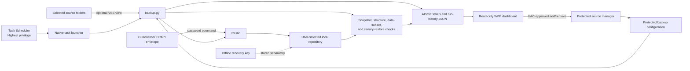

# Architecture

This document describes ResticBackuper v0.1.0-alpha.2 for Windows x64. The
design wraps Restic with conservative validation, Windows scheduling and VSS,
local telemetry, and a recovery workflow. Restic remains the component that
creates, encrypts, deduplicates, and restores repository snapshots.

## Runtime flow

The scheduled task launches a small native supervisor from the protected
installation directory. The supervisor starts the embedded Python interpreter
in isolated mode and assigns it to a Windows job object. Closing the supervisor
also terminates descendants, reducing the chance that an abandoned Restic
process continues writing to the repository.

`backup.py` obtains a single-run lock, validates the configured repository
volume and available space, and invokes Restic with the exact source and
exclusion set. When configured, Restic asks Windows VSS for filesystem
snapshots of local fixed NTFS sources so open files can be read from a
consistent view.

## Successful-run criteria

A Restic process exit code alone does not mark a run successful. The wrapper
also requires:

1. A complete Restic summary without an incomplete snapshot.
2. A snapshot bound to the expected hostname, tag, and exact configured source
   set.
3. A successful `restic check` of repository structure.
4. A restore of the installed canary file into a temporary state directory,
   including Restic verification and a local SHA-256/content-size comparison.
5. On the configured weekday, a successful rotating read of one repository
   data subset. The default configuration divides this deeper check into 30
   parts.

Only after these checks does the wrapper atomically update the last-successful
run record. The canary proves that this run can locate, decrypt, and restore a
known small file; it does not prove that every user file is healthy. Independent
restores of representative user data remain essential.

## Components

| Component | Responsibility | Write scope |
| --- | --- | --- |
| `ResticBackuperTaskLauncher.exe` | Supervises the scheduled Python/Restic process and ties descendants to a kill-on-close job object | None directly |
| Embedded Python and `backup.py` | Validates configuration, drives Restic, verifies results, records status | Repository through Restic; protected state |
| `restic.exe` | Creates encrypted snapshots, checks the repository, and restores data | Repository and explicit restore target |
| `ResticBackuperDashboard.exe` | Reads status, logs, history, and configured sources; launches explicit UAC folder changes | No direct configuration or repository writes |
| `Manage-Sources.ps1` | Validates and transactionally adds/removes future backup sources while holding the run lock; a durable undo journal coordinates atomic per-file replacements | Protected configuration, protected journal, and recovery-tools metadata |
| `restore.py` | Guards snapshot listing and restores to a non-overlapping new or empty target | Explicit restore target only |
| Installer/uninstaller | Installs protected runtime, creates tasks and shortcuts, manages application binaries | Program Files, ProgramData, Task Scheduler, registry, chosen repository during initialization |

## On-disk boundaries

### `C:\Program Files\ResticBackuper`

Contains the manifest-hashed application payload: embedded Python, Restic,
the Python wrappers, configuration, dashboard, task launcher, exclusions, and
uninstaller. The scheduled task runs at Highest privilege for VSS access, so
ordinary users must not be able to replace files in this tree.

### `C:\ProgramData\ResticBackuper`

Contains the CurrentUser DPAPI password envelope, protected restore canary, run
lock, status records, JSONL logs, last-successful record, and local metrics
history. During a folder-list change it may also contain the protected
source-update undo journal. Writers run from the protected scheduled task or
elevated source manager; the dashboard receives read access.

### User-selected repository

Contains Restic's encrypted repository. The alpha installer accepts only a
local fixed or removable NTFS drive-letter path and records its volume serial
number. A separate physical drive is strongly recommended. Each run refuses
to continue if the configured path resolves to a different volume, helping
catch drive-letter reuse or accidental redirection.

The repository must not overlap a source. No automatic `forget`, `prune`, or
repository deletion occurs in this release.

### Recovery material

The installer places a self-contained recovery-tools directory beside the
repository and initially writes a plaintext recovery-key file to the installing
user's profile root. The tools intentionally do not contain the
password. The user must move the key to separate, secure storage.

The DPAPI envelope is convenient for unattended use on the current Windows
profile. It is not a substitute for the recovery key: after loss of that
profile, the envelope may be unusable.

## Installer and supply chain

The public alpha is distributed as a transparent ZIP, not a bootstrap
executable. It embeds pinned Windows x64 releases of Python 3.14.6 and Restic
0.19.1 so installation does not execute an unpinned network download.

The release build verifies the upstream archive hashes recorded in
`dependencies.json`, verifies the extracted Restic executable hash, and emits
a checksum for the final ZIP. The installer validates every staged payload
file against its own path, size, and SHA-256 manifest before copying it into
the protected runtime.

ZIP entry metadata is normalized, but the legacy .NET Framework C# compiler can
emit nondeterministic executable bytes. Rebuilding the same source is therefore
not guaranteed to reproduce the release ZIP byte for byte. The published
SHA-256 identifies the exact frozen release artifact; it is an integrity value,
not a reproducible-build claim.

This is integrity checking, not publisher authentication. v0.1.0-alpha.2 has
no Authenticode code signature, so users must obtain the checksum from the
project's GitHub release, compare it locally, and decide whether they trust the
project. A signed graphical installer is a future distribution goal, not a
property of this alpha.

## Installation and privilege model

The installer starts interactively as the intended backup user, then requests
UAC elevation. It verifies that elevation remains under the same Windows SID;
CurrentUser DPAPI material created through a different administrator account
would not work for the scheduled user.

Installation creates:

- a protected application directory and protected state directory;
- an initialized Restic repository, or validates the selected existing one;
- a daily Highest-level backup task for the installing user;
- optionally, a Limited-level dashboard task at logon;
- a Start menu shortcut and a Windows uninstall registration; and
- the DPAPI envelope, recovery key, and portable recovery tools.

The installer refuses an in-place alpha upgrade and refuses conflicting task
names or an existing runtime. The conservative uninstaller removes only the
application runtime, its verified scheduled tasks, shortcut, and uninstall
registration. It preserves the repository, ProgramData state, DPAPI envelope,
recovery key, and recovery tools.

The backup task uses an interactive logon token so CurrentUser DPAPI and the
user profile are available. Scheduled runs therefore require the installing
user to be signed in.

The limited dashboard cannot write Program Files. Add/remove actions start the
protected source manager through UAC with the requesting user's SID. The
manager takes the same byte-range lock used by the backup wrapper, rejects
repository/runtime/state overlap and nested sources, protects the canary and
last user source, and enforces the same drive policy as installation: every
source must be on a ready local fixed or removable drive-letter volume; VSS
tightens that policy to fixed NTFS volumes. UNC and network sources are never
accepted. Removing a source changes future snapshots only; it never forgets or
prunes existing snapshots.

Before replacing any of the four coupled source-metadata files, the manager
writes and flushes a protected undo journal containing the verified previous
and proposed bytes for fixed target identities. Each file is then replaced
atomically and the new set is fully revalidated. Deleting the journal is the
commit point. A backup refuses to start while a journal is pending; after a
process termination or restart, the next manager invocation restores and
verifies the complete previous set before deleting the journal. This avoids
consuming a mixed live/recovery manifest set after an interrupted change.

## Failure behavior

- A process-level run lock prevents concurrent wrapper runs.
- A pending protected source-update journal makes backup runs fail closed. The
  next elevated source-manager invocation uses its undo records to restore and
  verify the complete pre-change metadata set before normal work continues.
- Restic retries repository locks for a bounded period.
- State JSON is replaced atomically so the dashboard does not consume a
  partially written file.
- A failed backup or verification leaves an error status and does not replace
  the last-successful record.
- Installer rollback removes newly created application objects while
  preserving repository and recovery data.
- Restore operations reject overlapping or non-empty targets and never need to
  modify the repository.

## Boundaries and non-goals for the alpha

- Only Windows x64 and local fixed/removable NTFS repositories are supported.
- Sources must be existing folders on ready local fixed or removable
  drive-letter volumes; UNC and network sources are unsupported even when VSS
  is disabled.
- VSS support is limited to local fixed NTFS source volumes. Disabling VSS can
  admit supported local removable or non-NTFS source volumes.
- There is no code signature, automatic updater, or in-place upgrade.
- There is no built-in cloud upload, off-site replication, retention, pruning,
  or repository deletion workflow.
- Dashboard estimates are based on observed local telemetry and can change as
  file mix, cache state, and storage speed change.
- Canary verification is deliberately narrow and does not replace full or
  sampled user-file restore drills.
