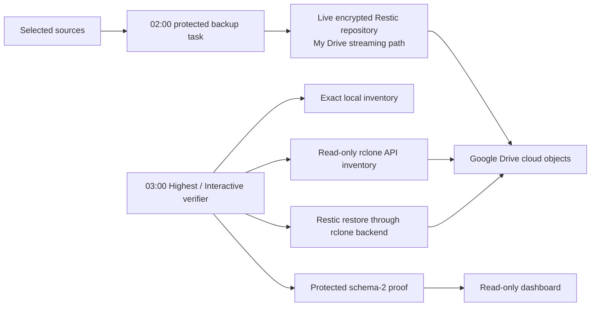

# Direct Google Drive repository verification

ResticBackuper supports one deliberately explicit Google Drive architecture:
the live encrypted Restic repository is a strict descendant of the Google Drive
for desktop **My Drive** streaming mount. Restic writes that repository through
DriveFS, and a separate elevated task verifies the same objects through the
Google Drive API. There is no second local mirror, ZIP, copy destination, or
promotion step.

This mode is useful when one repository path is the priority, but it is not an
offline copy. A synchronization mistake, account loss, provider outage, or an
attacker with access to the Drive account can still affect availability. Keep
the recovery key offline and maintain another independent backup when the data
matters.

## Data flow and trust boundaries



The backup and cloud-verification tasks share
`C:\ProgramData\ResticBackuper\run.lock`. The verifier opens and byte-locks the
existing protected file while elevated; it does not weaken the state ACL.
Consequently, a backup and a cloud inventory/restore cannot inspect and mutate
the repository concurrently.

The verifier never discovers executables or configuration through `PATH` or a
user-writable application-data directory. It accepts only:

- the manifest-hashed ResticBackuper runtime in
  `C:\Program Files\ResticBackuper`;
- `rclone.exe`, an encrypted rclone configuration, the CurrentUser-DPAPI
  configuration-password envelope, and the packaged password helper under
  `C:\ProgramData\ResticBackuperCloudVerification`; and
- a hash/length manifest for exactly those four cloud assets.

The cloud asset root is Administrators-owned, has protected inheritance, gives
SYSTEM and Administrators full control, and gives the scheduled user read and
execute access only when not elevated. Reparse points and unmanifested asset
names fail closed. Rclone receives a protected per-run configuration copy so an
OAuth token refresh cannot alter the immutable master configuration.

## What a successful verification proves

`verify_my_drive_cloud_repository.ps1` derives the API path from the exact live
repository path below the configured My Drive root. It then requires all of the
following:

1. The most recent `last-success.json` belongs to the active plan, configuration
   generation, repository ID, repository path, storage mode, and complete
   snapshot ID.
2. Local and API-backed `restic cat config` return the same complete repository
   ID.
3. Every local repository file has one case-sensitive API object match with the
   same byte length, MD5, SHA-256, and a provider object ID. Missing, extra,
   duplicate, hashless, unstable, or mismatched objects fail the run.
4. The direct-cloud Restic snapshot listing is a top-level JSON array whose
   every item has a unique complete identity and valid RFC3339Nano timestamp.
   Timestamps are ordered at full nanosecond precision after numeric offsets are
   normalized to UTC; the protected last-success snapshot must be among the
   newest timestamps.
5. Restic restores the protected canary from the complete snapshot ID through
   the `rclone:` backend with `--no-lock`, `--no-cache`, and `--verify`.
6. The restored canary has the expected byte length and SHA-256.

Native stdout and stderr are copied from process byte streams into protected
files. This avoids Windows PowerShell 5.1 text redirection changing JSON or
binary-sensitive output.

The immutable run proof is stored below:

```text
C:\ProgramData\ResticBackuperCloudVerification\runs\<run-id>\
```

The dashboard reads only the atomically replaced current proof:

```text
C:\ProgramData\ResticBackuperCloudVerification\evidence\latest-verification.json
```

It accepts only schema 2, post-activation, direct-cloud evidence. A new backup
attempt, plan or generation change, repository move, repository-ID change, or
new snapshot makes the old proof stale. Legacy local-mirror status cannot
produce a green off-site state.

## Provision the verification task

First install ResticBackuper with `google_drivefs_stream`, run one real backup,
and confirm that it succeeds. The live repository must be below the configured
My Drive streaming root; for example:

```text
G:\My Drive\ResticBackups\Personal
```

Install a reviewed Windows x64 rclone build separately. Create a dedicated
Google Drive remote named `ResticBackuperGoogleReadOnly` and authorize it with
the `drive.readonly` scope from the beginning. The verifier forces the
read-only backend option and My Drive root for every invocation, but it cannot
retroactively reduce the OAuth grant of a token that was originally issued
with broader access.

Create the remote in a temporary configuration file and encrypt the whole
configuration with `rclone config encryption set`. Do not confuse encrypted
configuration with rclone's reversible `obscure` encoding.

Store the rclone configuration password as a `PSCredential` DPAPI envelope.
Run this as the same Windows user that owns the backup task:

```powershell
$credentialSource = Join-Path $env:TEMP 'rclone-config-password.clixml'
$configurationPassword = Read-Host `
  'Rclone configuration password' `
  -AsSecureString
$credential = [PSCredential]::new(
  'rclone-config',
  $configurationPassword
)
$credential | Export-Clixml -LiteralPath $credentialSource
Remove-Variable credential, configurationPassword
```

Never put the plaintext value in a command argument, script, log, or task
definition.

From a same-user elevated Windows PowerShell 5.1 session, provision the assets
and register the verification-only task:

```powershell
$runtime = 'C:\Program Files\ResticBackuper'
$rcloneExe = 'C:\Path\To\Reviewed\rclone.exe'
$rcloneConfig = 'C:\Path\To\Encrypted\rclone-readonly.conf'
$credentialSource = Join-Path $env:TEMP 'rclone-config-password.clixml'
$rcloneExeHash = (
  Get-FileHash $rcloneExe -Algorithm SHA256
).Hash.ToLowerInvariant()
$rcloneConfigHash = (
  Get-FileHash $rcloneConfig -Algorithm SHA256
).Hash.ToLowerInvariant()
$credentialHash = (
  Get-FileHash $credentialSource -Algorithm SHA256
).Hash.ToLowerInvariant()

& (Join-Path $runtime 'install_google_drive_sync_task.ps1') `
  -ProvisionAssets `
  -RcloneExecutableSource $rcloneExe `
  -RcloneConfigSource $rcloneConfig `
  -RcloneCredentialSource $credentialSource `
  -ExpectedRcloneExecutableSha256 $rcloneExeHash `
  -ExpectedRcloneConfigSha256 $rcloneConfigHash `
  -ExpectedRcloneCredentialSha256 $credentialHash
```

The password helper is always copied from the manifest-authorized Program Files
runtime; an arbitrary helper is rejected. Independently compare the rclone
executable hash with the checksum published for the build you reviewed before
running the command.

For compatibility with installations that used the earlier mirror experiment,
the default task name remains `ResticBackuperGoogleDriveSync`. Its installed
action is now verification-only: daily at 03:00, `InteractiveToken`, Highest,
`IgnoreNew`, and `StartWhenAvailable`. Installation does not start it and never
copies, deletes, prunes, or modifies repository objects.

After the task completes, inspect Task Scheduler and the dashboard. A successful
task is not enough by itself: the dashboard must show **Google Drive repository
verified**, with an API-confirmed exact inventory and independent direct-cloud
restore bound to the latest successful backup.

## Operational limitations

- The task needs the installing user to be signed in because both Restic and
  rclone credentials use CurrentUser DPAPI and an interactive token.
- This verifier supports the explicit My Drive streaming repository mode only.
  A `local_ntfs` repository needs a separately designed off-site system.
- Updating rclone, changing its encrypted configuration, rotating the
  configuration password, changing accounts, or changing the remote requires a
  reviewed reprovisioning procedure. Existing protected assets are never
  silently overwritten.
- An exact API inventory and direct restore prove that the verified encrypted
  repository generation was readable from Google Drive at that time. They do
  not make the provider account immutable or offline.
- A destructive-change anomaly still requires exact operator acknowledgement
  before future deletion or retention work. That review does not pause DriveFS
  upload because the sole repository is already live below the streaming mount.
